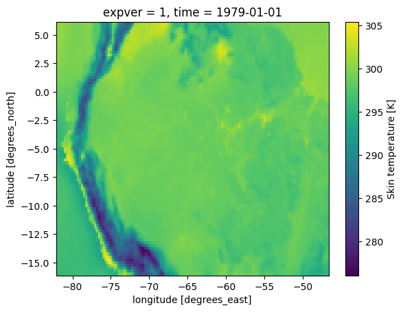
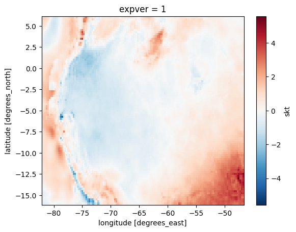
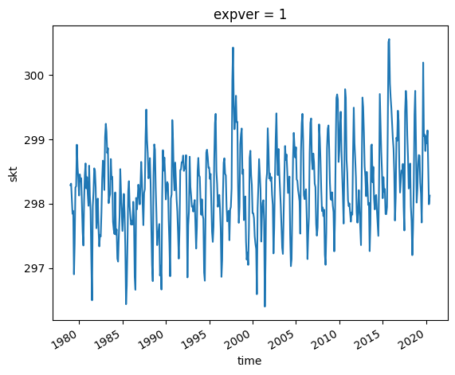
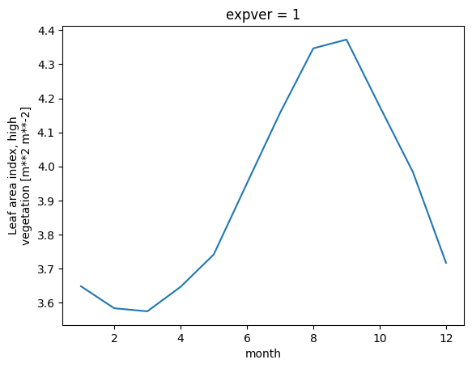

# Climate Geospatial Analysis

This code is written in Python and is used to work with a type of data called netCDF, which is a way of storing scientific data.

The code is using a library called xarray, which is a tool that makes it easier to read and manipulate netCDF data. The data being used contains information about things like temperature and vegetation across the globe.

The code is selecting specific parts of the data based on their location, time, or other factors. For example, it's selecting data for a specific latitude and longitude or for a specific time range.

The code is also doing some calculations on the data, like finding the average temperature or the change in temperature over time. This helps to understand patterns in the data and how they are changing over time.

Finally, the code is exporting the data into a new file and then reading that file back in to make sure everything worked correctly.

Overall, this code is a powerful tool for working with scientific data and can help researchers understand the patterns and changes in environmental data over time.

Within the analyzes carried out, the following results were obtained:
- A graph of the temperature of the area of interest (Brazil) in 1979 (and for the following years until 2020. 
- A graph of the temperature change in the area between 1979 and 2020.
- A graphical analysis of the change in median temperature between 1979 and 2020 shows a slight increase.
- A graphical analysis of the temperature variation depending on the month of the year. 

