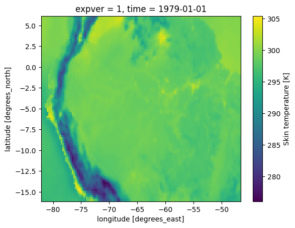
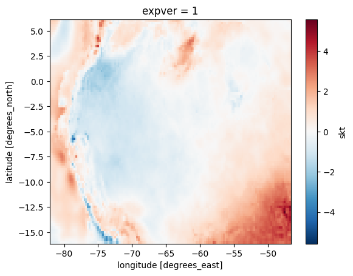
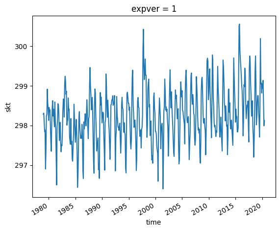

# Climate Geospatial Data Analysis

This small project is an exploratory data analysis using the xarray library and verifying its functionality. Xarray is a Python library that makes it easy to work with multidimensional labeled data. It allows you to manipulate, analyze, and visualize data in a much more efficient way than native Python data structures. Also, xarray is compatible with many other Python libraries, which makes it even more useful. In this project, I was able to experience first-hand the benefits of working with xarray and I highly recommend using it for any Python data analysis project.
Within the analyzes carried out, the following results were obtained:
- A graph of the temperature of the area of interest (Brazil) in 1979 (and for the following years until 2020. 

- A graph of the temperature change in the area between 1979 and 2020.

- A graphical analysis of the change in median temperature between 1979 and 2020 shows a slight increase.

- A graphical analysis of the temperature variation depending on the month of the year.

